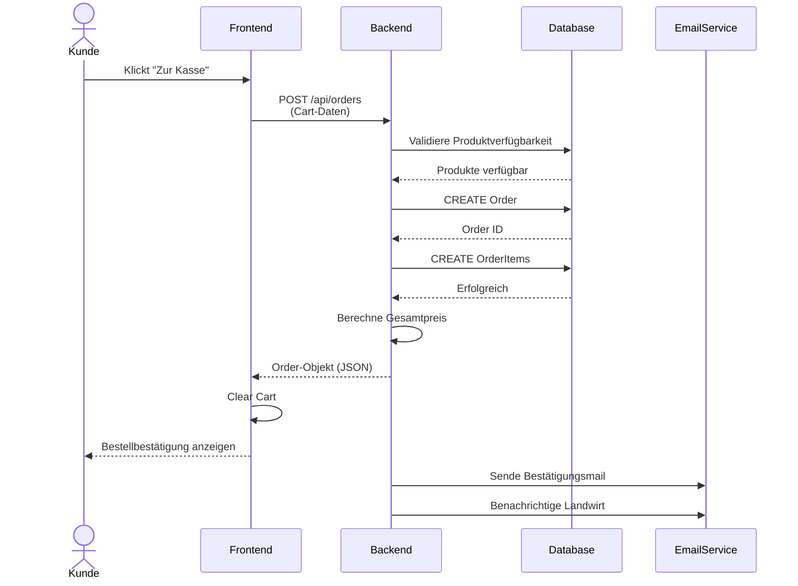
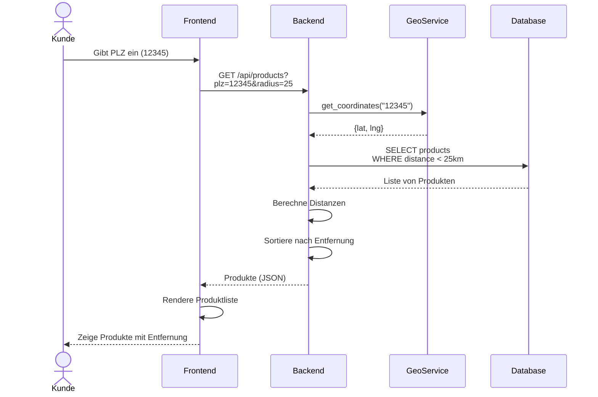
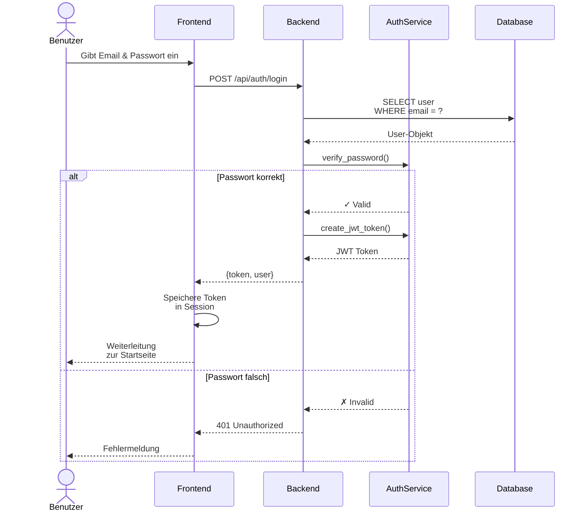
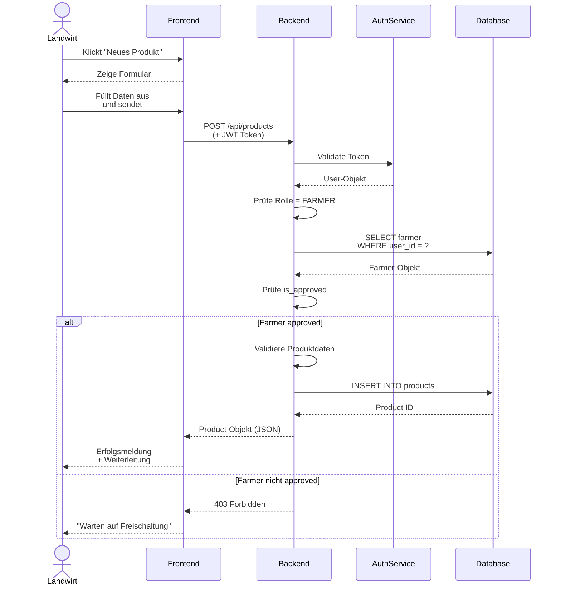
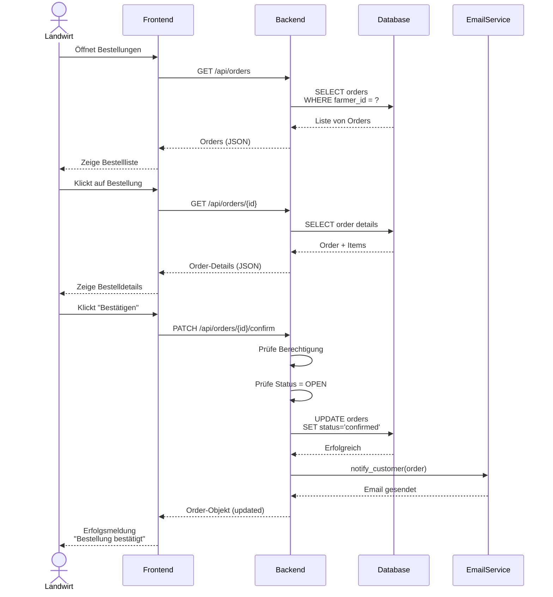

# 🔄 Sequenzdiagramme

Sequenzdiagramme zeigen den **zeitlichen Ablauf** von Interaktionen zwischen Objekten.

---

## Sequenz 1: Bestellung aufgeben

Dieser Ablauf zeigt, wie ein Kunde eine Bestellung aufgibt.

### Diagramm



!!! tip "Diagramm als Bild"
    Für Präsentationen: `docs/images/sequenz-bestellung.png`

### Beschreibung

**Akteure:**

- Kunde
- Frontend (UI)
- Backend (API)
- Datenbank

**Ablauf:**

1. **Kunde** → **Frontend**: Klickt auf "Zur Kasse"
2. **Frontend** → **Backend**: `POST /api/orders` (Cart-Daten)
3. **Backend** → **Datenbank**: Validiere Produktverfügbarkeit
4. **Datenbank** → **Backend**: Produkte verfügbar
5. **Backend** → **Datenbank**: Erstelle Order & OrderItems
6. **Datenbank** → **Backend**: Order ID
7. **Backend** → **Backend**: Berechne Gesamtpreis
8. **Backend** → **Frontend**: Order-Objekt (JSON)
9. **Frontend** → **Kunde**: Bestellbestätigung anzeigen
10. **Backend** → **E-Mail-Service**: Sende Bestätigungsmail
11. **Backend** → **E-Mail-Service**: Benachrichtige Landwirt

**Pseudocode:**

```python
# Frontend
def checkout():
    cart = get_current_cart()
    response = api.post("/orders", cart.to_json())
    if response.success:
        show_confirmation(response.order)
        clear_cart()

# Backend
def create_order(cart_data):
    # Validierung
    for item in cart_data.items:
        product = db.get_product(item.product_id)
        if not product.available:
            raise ProductNotAvailableError()
    
    # Order erstellen
    order = Order(
        customer_id=current_user.id,
        farmer_id=cart_data.farmer_id
    )
    
    total = 0
    for item in cart_data.items:
        order_item = OrderItem(
            product_id=item.product_id,
            quantity=item.quantity,
            unit_price=item.product.price
        )
        order.add_item(order_item)
        total += order_item.get_subtotal()
    
    order.total_price = total
    db.save(order)
    
    # Benachrichtigungen
    email_service.send_confirmation(order)
    email_service.notify_farmer(order)
    
    return order
```

---

## Sequenz 2: Produktsuche (Umkreis)

Zeigt, wie die Umkreissuche funktioniert.

### Diagramm



!!! tip "Diagramm als Bild"
    Für Präsentationen: `docs/images/sequenz-suche.png`

### Beschreibung

**Akteure:**

- Kunde
- Frontend
- Backend
- Datenbank

**Ablauf:**

1. **Kunde** → **Frontend**: Gibt PLZ ein (z. B. "12345")
2. **Frontend** → **Backend**: `GET /api/products?plz=12345&radius=25`
3. **Backend** → **Backend**: Berechne Koordinaten der PLZ
4. **Backend** → **Datenbank**: `SELECT * FROM products WHERE distance < 25`
5. **Datenbank** → **Backend**: Liste von Produkten
6. **Backend** → **Frontend**: Produkte (JSON)
7. **Frontend** → **Kunde**: Zeige Produktliste

**Pseudocode:**

```python
# Backend
def search_products(plz: str, radius_km: int):
    # PLZ zu Koordinaten
    coords = geocoding_service.get_coordinates(plz)
    
    # Produkte im Umkreis finden
    products = db.query("""
        SELECT p.*, f.farm_plz, f.farm_city,
               DISTANCE(f.coordinates, :coords) as distance
        FROM products p
        JOIN farmers f ON p.farmer_id = f.id
        WHERE p.available = true
          AND DISTANCE(f.coordinates, :coords) <= :radius
        ORDER BY distance ASC
    """, coords=coords, radius=radius_km)
    
    return products
```

---

## Sequenz 3: Login

Authentifizierungsprozess.

### Diagramm



!!! tip "Diagramm als Bild"
    Für Präsentationen: `docs/images/sequenz-login.png`

### Beschreibung

**Akteure:**

- Benutzer
- Frontend
- Backend (AuthService)
- Datenbank

**Ablauf:**

1. **Benutzer** → **Frontend**: Gibt E-Mail & Passwort ein
2. **Frontend** → **Backend**: `POST /api/auth/login` (E-Mail, Passwort)
3. **Backend** → **Datenbank**: `SELECT * FROM users WHERE email = ?`
4. **Datenbank** → **Backend**: User-Objekt
5. **Backend** → **Backend**: Verifiziere Passwort-Hash
6. **Backend** → **Backend**: Erstelle JWT-Token
7. **Backend** → **Frontend**: Token + User-Daten
8. **Frontend** → **Frontend**: Speichere Token in Session
9. **Frontend** → **Benutzer**: Leite zur Startseite weiter

**Pseudocode:**

```python
# Backend
def login(email: str, password: str):
    # User finden
    user = db.find_user_by_email(email)
    if not user:
        raise InvalidCredentialsError()
    
    # Passwort prüfen
    if not verify_password(password, user.password_hash):
        raise InvalidCredentialsError()
    
    # JWT erstellen
    token = create_jwt_token(user.id, user.role)
    
    return {
        "token": token,
        "user": user.to_dict()
    }
```

---

## Sequenz 4: Produkt anlegen (Landwirt)

Landwirt erstellt ein neues Produkt.

### Diagramm



!!! tip "Diagramm als Bild"
    Für Präsentationen: `docs/images/sequenz-produkt-anlegen.png`

### Beschreibung

**Akteure:**

- Landwirt
- Frontend
- Backend
- Datenbank

**Ablauf:**

1. **Landwirt** → **Frontend**: Klickt auf "Neues Produkt"
2. **Frontend** → **Landwirt**: Zeige Formular
3. **Landwirt** → **Frontend**: Füllt Produktdaten aus
4. **Frontend** → **Backend**: `POST /api/products` (Produktdaten)
5. **Backend** → **Backend**: Validiere Eingaben
6. **Backend** → **Backend**: Prüfe Berechtigung (ist Landwirt?)
7. **Backend** → **Datenbank**: `INSERT INTO products ...`
8. **Datenbank** → **Backend**: Product ID
9. **Backend** → **Frontend**: Product-Objekt
10. **Frontend** → **Landwirt**: Bestätigung & Weiterleitung

**Pseudocode:**

```python
# Backend
def create_product(data: dict, current_user: User):
    # Berechtigung prüfen
    if current_user.role != UserRole.FARMER:
        raise PermissionDeniedError()
    
    # Farmer-Profil holen
    farmer = db.get_farmer_by_user_id(current_user.id)
    if not farmer.is_approved:
        raise FarmerNotApprovedError()
    
    # Validierung
    validate_product_data(data)
    
    # Produkt erstellen
    product = Product(
        farmer_id=farmer.id,
        name=data["name"],
        description=data["description"],
        category=data["category"],
        price=data["price"],
        unit=data["unit"],
        bio=data.get("bio", False),
        available=True
    )
    
    db.save(product)
    return product
```

---

## Sequenz 5: Bestellung bestätigen (Landwirt)

Landwirt bestätigt eine eingehende Bestellung.

### Diagramm



!!! tip "Diagramm als Bild"
    Für Präsentationen: `docs/images/sequenz-bestellung-bestaetigen.png`

### Beschreibung

**Akteure:**

- Landwirt
- Frontend
- Backend
- Datenbank
- E-Mail-Service

**Ablauf:**

1. **Landwirt** → **Frontend**: Öffnet Bestellung
2. **Frontend** → **Backend**: `GET /api/orders/{id}`
3. **Backend** → **Datenbank**: Lade Order
4. **Datenbank** → **Backend**: Order-Objekt
5. **Backend** → **Frontend**: Order (JSON)
6. **Frontend** → **Landwirt**: Zeige Bestelldetails
7. **Landwirt** → **Frontend**: Klickt "Bestätigen"
8. **Frontend** → **Backend**: `PATCH /api/orders/{id}/confirm`
9. **Backend** → **Datenbank**: `UPDATE orders SET status = 'confirmed'`
10. **Backend** → **E-Mail-Service**: Benachrichtige Kunde
11. **Backend** → **Frontend**: Bestätigung
12. **Frontend** → **Landwirt**: Erfolgsm message

**Pseudocode:**

```python
# Backend
def confirm_order(order_id: int, current_user: User):
    # Order laden
    order = db.get_order(order_id)
    
    # Berechtigung prüfen
    farmer = db.get_farmer_by_user_id(current_user.id)
    if order.farmer_id != farmer.id:
        raise PermissionDeniedError()
    
    # Status prüfen
    if order.status != OrderStatus.OPEN:
        raise InvalidOrderStatusError()
    
    # Bestätigen
    order.status = OrderStatus.CONFIRMED
    order.updated_at = datetime.now()
    db.save(order)
    
    # Kunde benachrichtigen
    email_service.notify_customer_order_confirmed(order)
    
    return order
```

---

## 🎯 Zusammenfassung

Die Sequenzdiagramme zeigen:

- **Zeitlichen Ablauf** von Interaktionen
- **Kommunikation** zwischen Komponenten
- **Validierung** und **Fehlerbehandlung**
- **Externe Services** (E-Mail)

---

## 🚀 Nächste Schritte

Siehe auch:

- **[Use-Case-Diagramm](uml-usecase.md)** – Übersicht der Anwendungsfälle
- **[Klassendiagramm](uml-klassen.md)** – Systemstruktur
- **[API-Dokumentation](api.md)** – REST-Endpunkte im Detail
