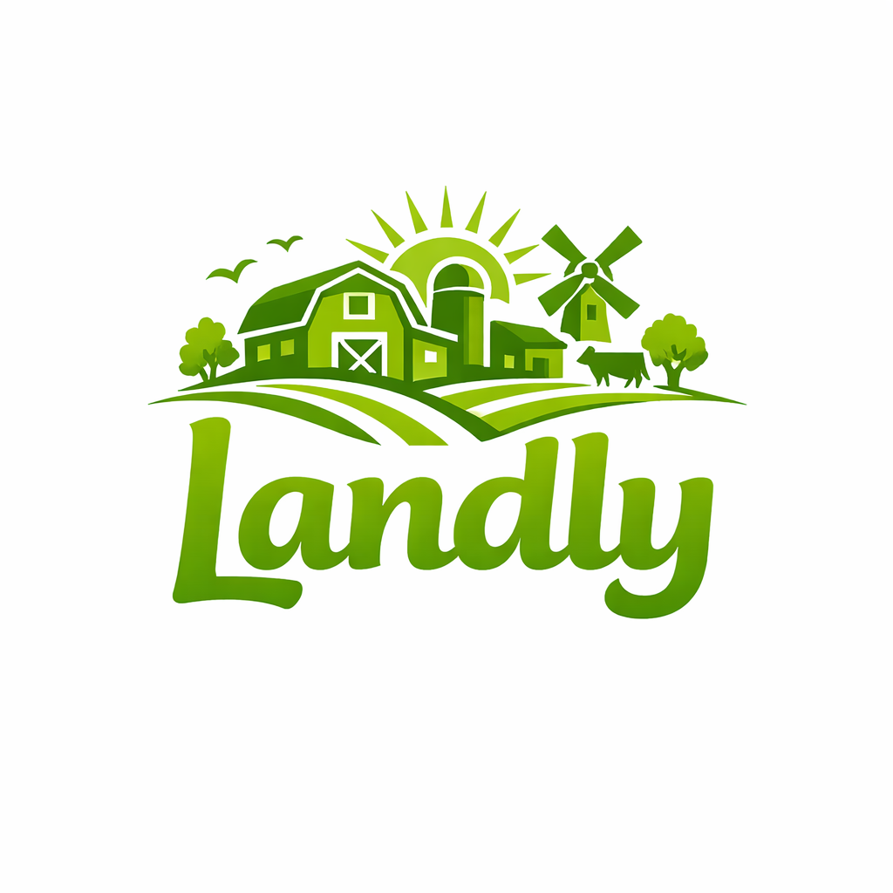

  
  <h1>Landly – Regionale Onlineplattform</h1>

  
  
  
  
  

---

## 📖 Übersicht

**Landly** verbindet regionale Landwirte direkt mit Kund:innen – ohne Umwege, ohne Zwischenhändler.

### 🎯 Value Proposition

!!! success "Das Problem"
    Lokale Landwirte haben keine digitale Sichtbarkeit. Kund:innen finden regionale Produkte nur schwer. Lieferwege sind unnötig lang.

!!! success "Unsere Lösung"
    Landly ist die digitale Plattform für direkten, regionalen Handel – mit Umkreissuche, transparenten Produktinfos und einfacher Bestellung zur Abholung.

!!! success "Der Mehrwert"
    ✅ **Für Kund:innen:** Frische Produkte aus der Nähe finden und bestellen  
    ✅ **Für Landwirte:** Digitale Sichtbarkeit und Direktvermarktung  
    ✅ **Für die Umwelt:** Kurze Lieferwege, weniger CO₂

---

## 🚀 Quick Start

!!! tip "Direkt loslegen"
    
    **Entwickler:**  
    → [Installation & Quick Start](installation.md) – Projekt lokal starten  
    → [Test-Accounts](dev/testdaten.md) – Sofort mit Demo-Daten testen  
    → [Technische Dokumentation](technische-dokumentation.md) – Architektur verstehen
    
    **User:**  
    → [Einführung](user/einfuehrung.md) – Erste Schritte mit Landly  
    → [Produkte suchen](user/produkte-suchen.md) – Lokale Produkte finden

---

## 🎯 Zielgruppen

!!! tip "Kund:innen"
    Personen, die regionale und frische Lebensmittel direkt vom Erzeuger kaufen möchten

!!! tip "Landwirt:innen"
    Regionale Landwirte, die ihre Produkte digital anbieten und verwalten möchten

!!! tip "Administrator:innen"
    Verantwortliche für Systemstabilität, Benutzerverwaltung und Support

---

## 🛠️ Technologien

Die Plattform wird mit folgenden Technologien entwickelt:

- **Frontend**: Flet (Python)
- **Backend**: FastAPI
- **Datenbank**: SQLite / PostgreSQL
- **Deployment**: Docker, GitHub Actions

---

## 📚 Navigation

!!! info "Dokumentationsbereiche"
    
    **[⚙️ Installation & Quick Start](installation.md)**  
    Schritt-für-Schritt-Anleitung zum Aufsetzen des Projekts
    
    **[👨‍💻 Technische Dokumentation](technische-dokumentation.md)**  
    Architektur, Datenbankmodell und API-Referenz
    
    **[📖 Nutzungshandbuch](user/einfuehrung.md)**  
    Anleitung zur Benutzung der Plattform (Registrierung, Produktsuche, Bestellung)
    
    **[🎯 Technische Strategie](dev/technische-uebersicht.md)**  
    Detaillierte technische Details, Setup, UML-Diagramme und Entscheidungen
    
    **[📅 Projektorganisation](organisation/weeklys-uebersicht.md)**  
    Wöchentliche Entwicklungsdokumentation und Teamorganisation

---

## ✨ Besonderheiten

- **Regionale Umkreissuche** – Produkte in der Nähe finden
- **Direkte Kommunikation** – zwischen Erzeuger und Kunde
- **Transparenz** – Produktdetails, Herkunft und Qualitätssiegel
- **Nachhaltigkeit** – kurze Lieferwege und lokale Unterstützung
