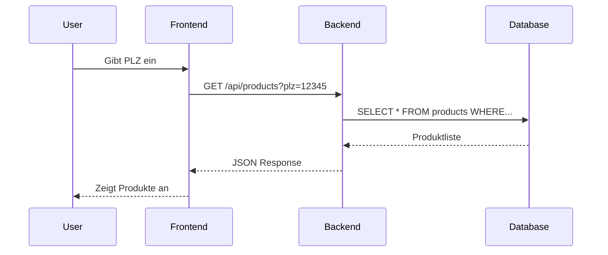
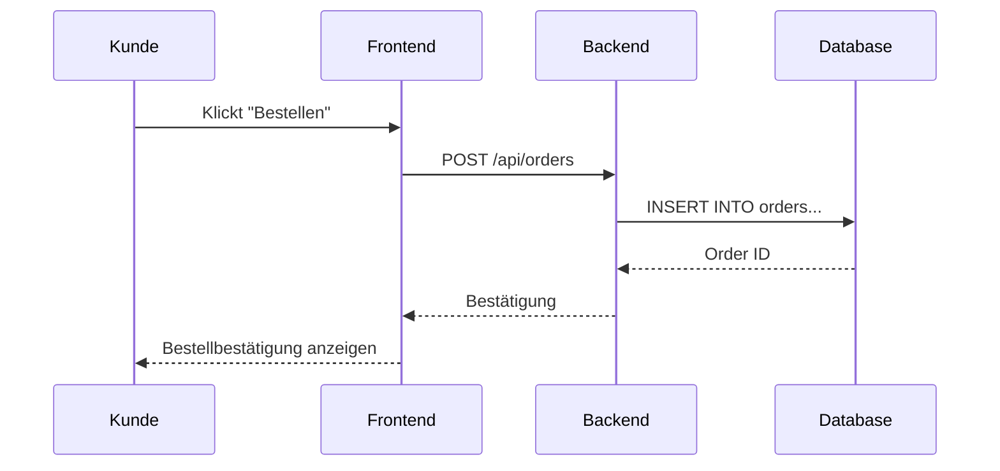

# 🏗️ Systemübersicht

Diese Seite gibt einen Überblick über die grundlegende Architektur von Landly.

---

## 📐 Projektlayout

Die Anwendung besteht aus folgenden Hauptkomponenten:

```
Landly
├── Frontend (Flet / Python)
│   ├── Benutzeroberfläche
│   ├── Navigation & Layout
│   └── Formulare & Dialoge
│
├── Backend (FastAPI)
│   ├── REST-API
│   ├── Business-Logik
│   └── Authentifizierung
│
├── Datenbank (SQLite/PostgreSQL)
│   ├── Benutzer
│   ├── Produkte
│   ├── Bestellungen
│   └── Anbieter
│
└── Administration
    ├── Benutzerverwaltung
    ├── Systemüberwachung
    └── Support
```

---

## 🎨 Architektur-Übersicht

Das System folgt einer klassischen **Client-Server-Architektur**:

!!! info "Architektur"
    ```
    ┌─────────────────┐
    │   Frontend      │  ← Flet (Python)
    │  (Benutzer-UI)  │
    └────────┬────────┘
             │
             │ HTTP / REST
             │
    ┌────────▼────────┐
    │   Backend       │  ← FastAPI
    │  (API & Logik)  │
    └────────┬────────┘
             │
             │ SQL
             │
    ┌────────▼────────┐
    │   Datenbank     │  ← SQLite / PostgreSQL
    │   (Persistenz)  │
    └─────────────────┘
    ```

---

## 🔄 Datenfluss

### Beispiel: Produktsuche



### Beispiel: Bestellung aufgeben



---

## 🧩 Komponenten

### Frontend (Flet)

**Technologie:** Python mit Flet-Framework

**Aufgaben:**

- Darstellung der Benutzeroberfläche
- Formulare und Eingabevalidierung
- Navigation zwischen Seiten
- Kommunikation mit Backend-API

**Hauptseiten:**

- Startseite / Landingpage
- Produktsuche
- Produktdetails
- Warenkorb
- Bestellübersicht
- Login / Registrierung
- Profilverwaltung
- Hofseite (für Landwirte)

---

### Backend (FastAPI)

**Technologie:** FastAPI (Python)

**Aufgaben:**

- REST-API bereitstellen
- Business-Logik implementieren
- Authentifizierung & Autorisierung
- Datenbankzugriffe verwalten
- Validierung von Eingaben

**Hauptmodule:**

- `auth.py` – Authentifizierung & Autorisierung
- `crud.py` – CRUD-Operationen
- `models.py` – Datenbank-Modelle
- `schemas.py` – Pydantic-Schemas
- `searchFunctions.py` – Suchlogik
- `warenkorbFunctions.py` – Warenkorb-Logik
- `profilFunctions.py` – Profilverwaltung

---

### Datenbank

**Technologie:** SQLite (Entwicklung) / PostgreSQL (Produktion)

**Aufgaben:**

- Persistierung aller Daten
- Strukturierte Speicherung
- Abfragen und Filterung

**Haupttabellen:**

- `users` – Benutzer (Kunden & Landwirte)
- `products` – Produkte
- `orders` – Bestellungen
- `farmers` – Landwirt-Profile
- `categories` – Produktkategorien

Siehe auch: [Logisches Modell](../dev/logisches-modell.md)

---

## 🔐 Sicherheit

!!! warning "Sicherheitskonzept"
    
    **Authentifizierung:**
    
    - JWT-Tokens für Sitzungen
    - Passwort-Hashing (bcrypt)
    
    **Autorisierung:**
    
    - Rollenbasierte Zugriffskontrolle (RBAC)
    - Benutzerrollen: Kunde, Landwirt, Admin
    
    **Datenvalidierung:**
    
    - Input-Validierung im Backend
    - SQL-Injection-Schutz durch ORM (SQLAlchemy)

---

## 🚀 Deployment

Die Anwendung wird über **GitHub Actions** automatisch deployed:

1. **Commit** → GitHub Repository
2. **CI/CD Pipeline** → Automatische Tests
3. **Build** → Docker-Container erstellen
4. **Deploy** → Server-Deployment

Siehe auch: [Setup & Installation](../dev/setup.md)

---

## 📊 Technologie-Stack

| Komponente | Technologie | Zweck |
|------------|-------------|-------|
| **Frontend** | Flet (Python) | UI-Framework |
| **Backend** | FastAPI | REST-API |
| **Datenbank** | SQLite / PostgreSQL | Persistenz |
| **ORM** | SQLAlchemy | Datenbank-Zugriff |
| **Auth** | JWT + bcrypt | Authentifizierung |
| **Testing** | pytest | Automatisierte Tests |
| **CI/CD** | GitHub Actions | Deployment |
| **Docs** | MkDocs | Dokumentation |

---

## 🔮 Erweiterbarkeit

Das System ist so konzipiert, dass es einfach erweitert werden kann:

- **Neue Features** → Modulare Struktur ermöglicht einfache Erweiterungen
- **Skalierung** → Microservices-Architektur möglich
- **Integration** → REST-API ermöglicht externe Anbindungen
- **Multi-Tenancy** → Mehrere Regionen / Plattformen möglich
