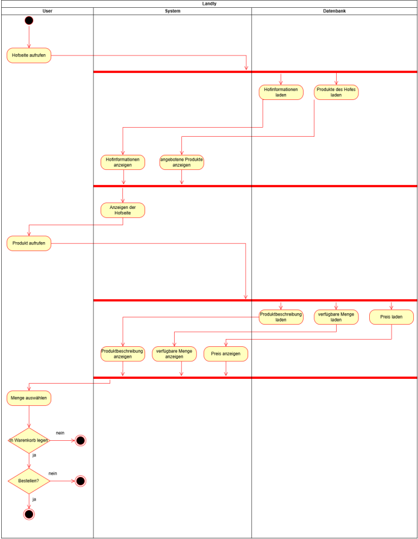
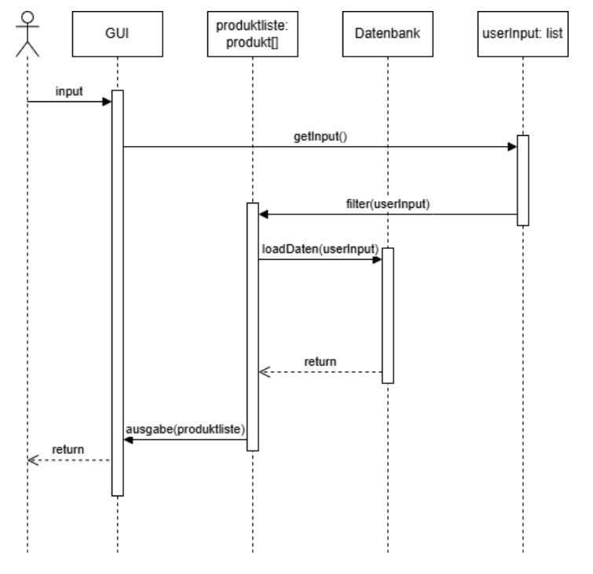
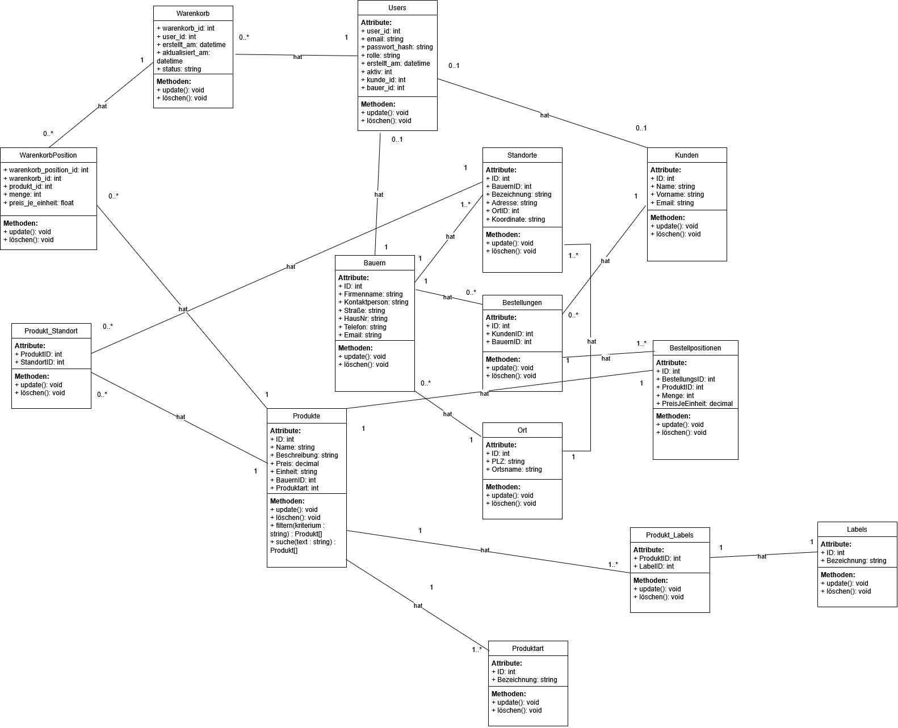

# 👨‍💻 Technische Dokumentation

Diese Seite bietet einen technischen Überblick über die Architektur und Struktur von Landly.

---

## 🏗️ Architekturdiagramm

Das Aktivitätsdiagramm zeigt den Ablauf und die Interaktionen im System:

{: style="max-width: 800px; width: 100%;"}

**Beschreibung:**

Das Diagramm visualisiert die Hauptaktivitäten und Entscheidungspunkte im System. Es zeigt, wie Benutzer durch verschiedene Prozesse navigieren - von der Registrierung über die Produktsuche bis zur Bestellung.

**Kernkomponenten:**
- Benutzer-Authentifizierung
- Produktsuche und Filterung
- Warenkorb-Verwaltung
- Bestellprozess
- Admin- und Landwirt-Funktionen

---

## 🔄 Sequenzdiagramm

Das Sequenzdiagramm zeigt die zeitliche Abfolge der Interaktionen zwischen Komponenten:

{: style="max-width: 800px; width: 100%;"}

**Beschreibung:**

Dieses Diagramm illustriert die Kommunikation zwischen Frontend, Backend und Datenbank während eines typischen Anwendungsfalls. Es zeigt den Nachrichtenfluss und die Reihenfolge der Operationen.

**Dargestellte Prozesse:**
- API-Requests und Responses
- Datenbank-Abfragen
- Authentifizierungs-Flow
- Datenvalidierung
- Fehlerbehandlung

---

## 🏛️ Klassendiagramm

Das Klassendiagramm zeigt die Objektstruktur und Beziehungen im System:

<div align="center">
  
{: style="max-width: 800px; width: 100%;"}hreibung:**

Das Klassendiagramm definiert die Hauptentitäten des Systems und deren Beziehungen. Es bildet die Grundlage für das Datenbankmodell und die Backend-Logik.

**Hauptklassen:**
- **User**: Benutzer (Kunde, Landwirt, Admin)
- **Farmer**: Erweiterte Landwirt-Informationen
- **Product**: Produkte der Landwirte
- **Order**: Bestellungen
- **OrderItem**: Bestellpositionen

**Beziehungen:**
- User ↔ Farmer (1:1)
- User ↔ Order (1:n)
- Farmer ↔ Product (1:n)
- Order ↔ OrderItem (1:n)
- Product ↔ OrderItem (n:m)

---

## 🗄️ Datenbankmodell

### Entitätsbeziehungsmodell

Das System basiert auf einem relationalen Datenbankmodell mit folgenden Haupttabellen:

#### Tabelle: users

Speichert alle Benutzer des Systems.

| Feld | Typ | Beschreibung | Constraints |
|------|-----|--------------|-------------|
| `id` | INTEGER | Primärschlüssel | PK, AUTO_INCREMENT |
| `email` | VARCHAR(255) | E-Mail-Adresse | UNIQUE, NOT NULL |
| `password_hash` | VARCHAR(255) | Gehashtes Passwort | NOT NULL |
| `first_name` | VARCHAR(100) | Vorname | NOT NULL |
| `last_name` | VARCHAR(100) | Nachname | NOT NULL |
| `role` | VARCHAR(20) | Rolle (customer/farmer/admin) | NOT NULL |
| `street` | VARCHAR(255) | Straße | NOT NULL |
| `plz` | VARCHAR(10) | Postleitzahl | NOT NULL |
| `city` | VARCHAR(100) | Stadt | NOT NULL |
| `phone` | VARCHAR(50) | Telefonnummer | NULL |
| `created_at` | DATETIME | Erstellungsdatum | DEFAULT NOW() |

**Anmerkungen:**
- E-Mail ist eindeutig und dient als Login
- Passwort wird mit bcrypt gehasht
- Rolle bestimmt Zugriffsrechte im System

---

#### Tabelle: farmers

Erweiterte Informationen für Landwirte.

| Feld | Typ | Beschreibung | Constraints |
|------|-----|--------------|-------------|
| `id` | INTEGER | Primärschlüssel | PK, AUTO_INCREMENT |
| `user_id` | INTEGER | Referenz zu users | FK, UNIQUE, NOT NULL |
| `farm_name` | VARCHAR(255) | Name des Hofes | NOT NULL |
| `description` | TEXT | Hofbeschreibung | NULL |
| `farm_street` | VARCHAR(255) | Straße des Hofes | NOT NULL |
| `farm_plz` | VARCHAR(10) | PLZ des Hofes | NOT NULL |
| `farm_city` | VARCHAR(100) | Stadt des Hofes | NOT NULL |
| `bio_certified` | BOOLEAN | Bio-Zertifizierung | DEFAULT FALSE |
| `is_approved` | BOOLEAN | Admin-Freigabe | DEFAULT FALSE |

**Anmerkungen:**
- Ein User kann nur ein Farmer-Profil haben
- `is_approved` muss `TRUE` sein, damit Produkte angelegt werden können
- `farm_plz` wird für Umkreissuche verwendet (indiziert)

---

#### Tabelle: products

Produkte der Landwirte.

| Feld | Typ | Beschreibung | Constraints |
|------|-----|--------------|-------------|
| `id` | INTEGER | Primärschlüssel | PK, AUTO_INCREMENT |
| `farmer_id` | INTEGER | Referenz zu farmers | FK, NOT NULL |
| `name` | VARCHAR(255) | Produktname | NOT NULL |
| `description` | TEXT | Produktbeschreibung | NULL |
| `category` | VARCHAR(100) | Kategorie | NOT NULL |
| `price` | DECIMAL(10,2) | Preis pro Einheit | NOT NULL |
| `unit` | VARCHAR(50) | Einheit (kg, Stück, etc.) | NOT NULL |
| `bio` | BOOLEAN | Bio-Qualität | DEFAULT FALSE |
| `available` | BOOLEAN | Verfügbarkeit | DEFAULT TRUE |
| `created_at` | DATETIME | Erstellungsdatum | DEFAULT NOW() |

**Anmerkungen:**
- Kategorie für Filterung (z.B. "Gemüse", "Obst", "Milchprodukte")
- Preis wird in Euro gespeichert
- `available` = `FALSE` graut Produkt aus (nicht mehr bestellbar)

---

#### Tabelle: orders

Bestellungen von Kunden.

| Feld | Typ | Beschreibung | Constraints |
|------|-----|--------------|-------------|
| `id` | INTEGER | Primärschlüssel | PK, AUTO_INCREMENT |
| `customer_id` | INTEGER | Referenz zu users | FK, NOT NULL |
| `farmer_id` | INTEGER | Referenz zu farmers | FK, NOT NULL |
| `status` | VARCHAR(20) | Status der Bestellung | NOT NULL |
| `total_price` | DECIMAL(10,2) | Gesamtpreis | NOT NULL |
| `pickup_date` | DATETIME | Geplantes Abholdatum | NULL |
| `created_at` | DATETIME | Bestelldatum | DEFAULT NOW() |
| `updated_at` | DATETIME | Letzte Änderung | DEFAULT NOW() |

**Status-Werte:**
- `open` - Bestellung eingegangen
- `confirmed` - Von Landwirt bestätigt
- `picked_up` - Abgeholt
- `cancelled` - Storniert

**Anmerkungen:**
- Eine Bestellung gehört zu genau einem Landwirt
- Total_price wird beim Erstellen berechnet und gespeichert
- Status-Updates ändern `updated_at` automatisch

---

#### Tabelle: order_items

Einzelne Positionen innerhalb einer Bestellung.

| Feld | Typ | Beschreibung | Constraints |
|------|-----|--------------|-------------|
| `id` | INTEGER | Primärschlüssel | PK, AUTO_INCREMENT |
| `order_id` | INTEGER | Referenz zu orders | FK, NOT NULL |
| `product_id` | INTEGER | Referenz zu products | FK, NOT NULL |
| `quantity` | INTEGER | Menge | NOT NULL |
| `unit_price` | DECIMAL(10,2) | Preis zum Bestellzeitpunkt | NOT NULL |

**Anmerkungen:**
- `unit_price` speichert Preis zum Zeitpunkt der Bestellung (historische Genauigkeit)
- Bei Produktlöschung bleibt OrderItem erhalten (ON DELETE RESTRICT)
- Gesamtpreis eines Items = `quantity * unit_price`

---

### Datenbank-Indizes

Für optimale Performance wurden folgende Indizes angelegt:

```sql
CREATE INDEX idx_users_email ON users(email);
CREATE INDEX idx_farmers_plz ON farmers(farm_plz);
CREATE INDEX idx_products_category ON products(category);
CREATE INDEX idx_products_available ON products(available);
CREATE INDEX idx_orders_customer ON orders(customer_id);
CREATE INDEX idx_orders_farmer ON orders(farmer_id);
CREATE INDEX idx_orders_status ON orders(status);
```

**Begründung:**
- `users.email`: Login-Vorgänge
- `farmers.farm_plz`: Umkreissuche
- `products.category`: Filterung nach Kategorie
- `orders.*_id`: Zugriff auf Bestellungen nach Benutzer/Landwirt

---

## 🔌 API-Referenz

### Übersicht

Die REST-API basiert auf **FastAPI** und folgt RESTful-Prinzipien.

**Base URL (lokal):** `http://localhost:8000/api`

**Authentifizierung:** JWT Bearer Token

### Hauptendpunkte

#### Authentifizierung

| Methode | Endpunkt | Beschreibung |
|---------|----------|--------------|
| POST | `/auth/register` | Neuen Benutzer registrieren |
| POST | `/auth/login` | Anmelden und Token erhalten |

#### Produkte

| Methode | Endpunkt | Beschreibung |
|---------|----------|--------------|
| GET | `/products` | Alle Produkte abrufen (mit Filtern) |
| GET | `/products/{id}` | Einzelnes Produkt abrufen |
| POST | `/products` | Neues Produkt erstellen (Farmer) |
| PUT | `/products/{id}` | Produkt aktualisieren (Farmer) |
| DELETE | `/products/{id}` | Produkt löschen (Farmer) |

#### Bestellungen

| Methode | Endpunkt | Beschreibung |
|---------|----------|--------------|
| GET | `/orders` | Eigene Bestellungen abrufen |
| GET | `/orders/{id}` | Einzelne Bestellung abrufen |
| POST | `/orders` | Neue Bestellung erstellen |
| PATCH | `/orders/{id}/status` | Bestellstatus ändern (Farmer) |

#### Landwirte

| Methode | Endpunkt | Beschreibung |
|---------|----------|--------------|
| GET | `/farmers/{id}` | Landwirt-Informationen |
| GET | `/farmers/{id}/products` | Produkte eines Landwirts |
| POST | `/farmers` | Farmer-Profil erstellen |

#### Suche

| Methode | Endpunkt | Beschreibung |
|---------|----------|--------------|
| GET | `/search?plz={plz}&radius={km}` | Umkreissuche nach PLZ |

#### Benutzer

| Methode | Endpunkt | Beschreibung |
|---------|----------|--------------|
| GET | `/users/me` | Eigenes Profil abrufen |
| PUT | `/users/me` | Eigenes Profil aktualisieren |

### Wichtige Datenstrukturen

#### Product (Response)

```json
{
  "id": 1,
  "farmer_id": 5,
  "farmer_name": "Hof Müller",
  "name": "Bio-Tomaten",
  "description": "Frische Tomaten aus biologischem Anbau",
  "category": "Gemüse",
  "price": 3.50,
  "unit": "kg",
  "bio": true,
  "available": true,
  "created_at": "2026-02-01T10:00:00"
}
```

#### Order (Response)

```json
{
  "id": 1,
  "customer_id": 2,
  "farmer_id": 5,
  "farmer_name": "Hof Müller",
  "status": "confirmed",
  "total_price": 15.50,
  "pickup_date": "2026-03-05T14:00:00",
  "created_at": "2026-03-01T09:30:00",
  "items": [
    {
      "product_name": "Bio-Tomaten",
      "quantity": 2,
      "unit_price": 3.50,
      "unit": "kg"
    }
  ]
}
```

---

## 📖 Weiterführende Dokumentation

Für detaillierte Informationen siehe:

- **[API-Dokumentation (vollständig)](dev/api.md)** - Alle Endpunkte mit Request/Response-Beispielen
- **[Datenbankschema](dev/datenbankschema.md)** - SQL-Definitionen und Queries
- **[UML-Diagramme](dev/uml-usecase.md)** - Use-Case, Klassen, Sequenz
- **[Technische Strategie](dev/technische-strategie.md)** - Architektur-Entscheidungen
- **[Setup & Installation](dev/setup.md)** - Entwicklungsumgebung einrichten

---

## 🎯 Architekturprinzipien

Das System folgt diesen Prinzipien:

### Separation of Concerns
- Frontend (Flet) → Präsentation
- Backend (FastAPI) → Business-Logik
- Datenbank (SQLite/PostgreSQL) → Persistenz

### Stateless API
- Authentifizierung via JWT
- Kein Server-Side Session-State
- Horizontal skalierbar

### RESTful Design
- Ressourcen-orientierte URLs
- HTTP-Methoden semantisch korrekt
- Standardisierte Error-Responses

### Security First
- Passwörter werden gehasht (bcrypt)
- SQL-Injection-Schutz durch ORM
- CORS konfiguriert
- Input-Validierung mit Pydantic

---

## 🔗 Externe Dokumentation

- **[FastAPI Docs](https://fastapi.tiangolo.com/)**
- **[Flet Docs](https://flet.dev/docs/)**
- **[SQLAlchemy Docs](https://docs.sqlalchemy.org/)**
